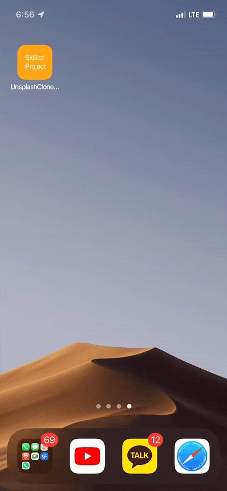
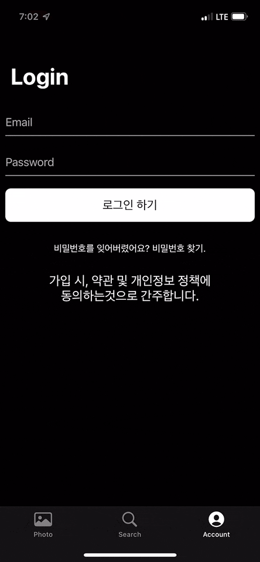

# 📱 UnSplash Clone Code!
Unsplash API를 활용하여, iOS Unsplash 앱을 따라 개발한 프로젝트 입니다. 
개발에 대한 내용은 다음 블로그에 기록하고 있습니다. 
https://skillist.tistory.com/category/iOS%20%EA%B0%9C%EB%B0%9C/Unsplash%20%ED%81%B4%EB%A1%A0%20%EC%BD%94%EB%94%A9 
  

# 🖼 ScreenShots

|App Launch|
|:---:|
||

  

|Photo Tab|
|:---:|
||

  

|Search Tab|
|:---:|
||

  

|Account Tab|
|:---:|
||

  

# 🗒 OpenSource
레이아웃 구성을 위한 SnapKit 학습을 위해 SnapKit을 사용하였으며 이외의 오픈소스는 의도적으로 사용하지 않았습니다.

|OpenSource|
|:---:|
|SnapKit|

 

* SnapKit (https://github.com/SnapKit/SnapKit) - MIT license 
  

# 📝 사용
Unsplash API를 사용하고 있어, Unsplash API의 accessKey가 필요합니다. 
PhotosAPI.swift 파일의 fetchPhotos 메소드에 본인의 Unsplash API - accessKey를 입력하세요. 
https://unsplash.com/developers 
  

# ❗️ 버그 및 피드백
버그나 수정사항, 피드백 등에 대하여 연락이 필요한 경우 블로그로 연락 부탁드립니다. 감사합니다. 
https://skillist.tistory.com/category/iOS%20%EA%B0%9C%EB%B0%9C/Unsplash%20%ED%81%B4%EB%A1%A0%20%EC%BD%94%EB%94%A9
  
